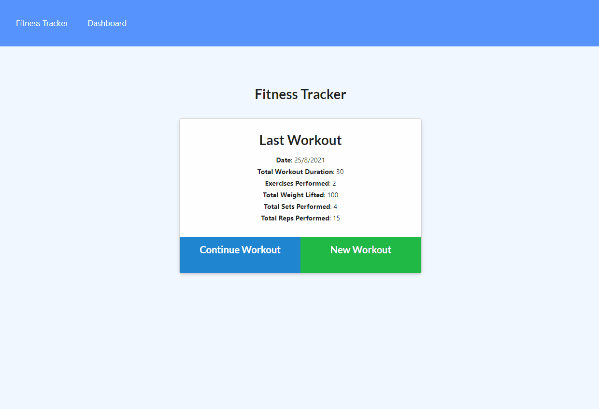

# adrianos-workout-tracker-18

Homework 18 - Wourkout Tracker NoSQL

## GitHub Repository 🚀

- [GitHub Repo Link](https://github.com/AdrianoArmen/adrianos-workout-tracker-18)

## App Deployment on Heroku 📦

- [App Deploy Link](https://safe-cliffs-79806.herokuapp.com/?id=61271664c9292e00160a9cab)

## Project Description 📋

This NoSQL workout tracker was designed to showcase my knowledge of [MongoDB](https://www.mongodb.com/es/cloud/atlas) and [Heroku](https://dashboard.heroku.com/apps) deployment. This application allows the user to track and save their exercise routine so they can manage their workout routine. The final part of the project was setting up the [Mongoose](https://mongoosejs.com/) database connection with [MongoDB Atlas](https://www.mongodb.com/es/cloud/atlas/register) and having all the desired functionality on the deployed link.

## Mockup 🔧

- The following animation demonstrates the actual application functionality:

## Technologies used 🛠️

- [MongoDB](https://www.mongodb.com/es/cloud/atlas) - global cloud database service
- [Mongoose](https://mongoosejs.com/) - database shchema and validation for MongoDB
- [Heroku](https://dashboard.heroku.com/apps) - deployment platform
- [NPM](https://www.npmjs.com/) - package manager

## License 📄

This project is licensed under the MIT License - see the [LICENSE.md](LICENSE.md) file for details

---

© 2021 Adriano.
